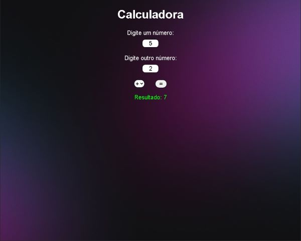

# Sobre Projeto:

Esse projeto é uma calculadora que realiza as operações básicas da matemática (soma, subtração, multiplicação e divisão), fiz ele para concretizar alguns conhecimentos de DOM (Document Object Model), interatividade com JavaScript e conceitos de HTML e CSS.

[Projeto disponível](https://projetocss-jesscoder.netlify.app/)

### Linguagens e Ferramentas

- HTML
- CSS
- Javascript
- Vscode
- Live Server

## Layout

### Desktop

### Mobile

### Fucionalidades do Projeto

Operações matemáticas básicas:

-  Soma
-  Subtração
-  Multiplicação
-  Divisão

### Autor

[Licenca MIT License](http://creativecommons.org/licenses/by)
